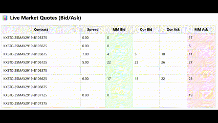

My copy market maker and live-testing capabilities will be here.

The idea is simple. Look for other people in the market who are placing orders with really large sizings, and undercut them. Based off a lot of analysis, the prices in the market posted by these people don't appear to be immiedietly exploitable. Sometimes they even exhibit incredibly large spreads, upwards of 20c especially when getting really close to expiry (<10m). 

High level overview of different features:
* ✅ **Real-time market making server**: Receives live BRTI and options data via WebSocket and responds with updated quotes.
* 📈 **Binary option pricing**: Computes theoretical fair prices using the binary call model and 60s realized volatility from BRTI.
* 🔀 **Quote logic**: Proposes tighter bid/ask spreads when possible, while respecting a minimum spread to avoid crossing.
* 📊 **Live trade execution**: Tracks filled trades, updates positions, calculates realized and unrealized PnL per contract.
* 📤 **Dashboard feed**: Emits structured data (quotes, PnL, trade log, volatility) to all connected clients via Flask-SocketIO.
* 🔁 **PnL finalization**: When a market expires, it closes all open positions and computes final realized profit/loss.
* 🧠 **Fully OOP**: Encapsulated all logic and state in a `MarketMaker` class for better modularity, testing, and maintainability.
